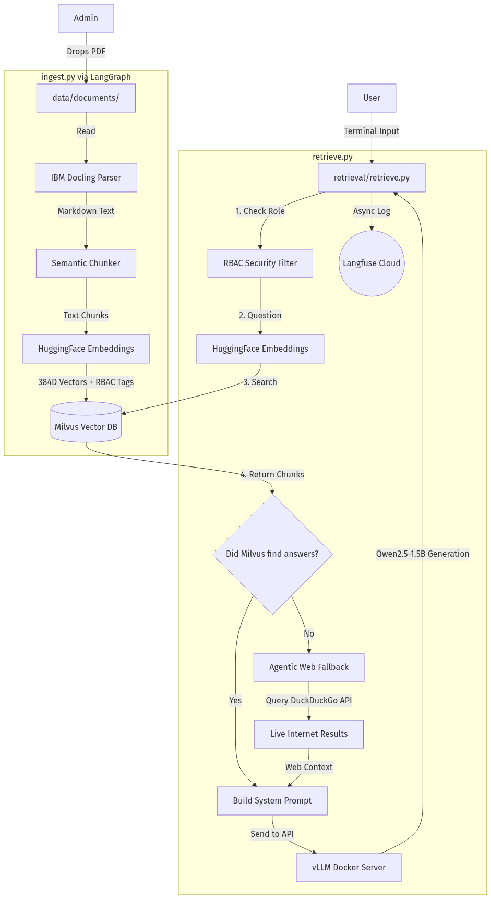

# Enterprise RAG System



This is a highly  secure, offline, enterprise-grade Retrieval-Augmented Generation (RAG) system built from scratch. It allows you to ingest private company PDFs and chat with an AI about them. If the AI doesn't know the answer, it automatically searches the live internet (DuckDuckGo fallback) to find it.

---

## Phase 1: Prerequisites & Folder Structure

### Step 1: Install Required Software
You must have these installed on your computer:
1. **Python 3.10+**: The programming language we will use.
2. **Docker Desktop**: This runs our heavy AI servers in isolated "containers" so they don't mess up your computer.

### Step 2: Create the Folders
Ensure you have the following directories in the project root:
```bash
mkdir data
mkdir data/documents
mkdir ingestion
mkdir retrieval
```
* **`data/documents`** is where you will drop your PDFs.
* **`ingestion`** will hold the script that reads the PDFs.
* **`retrieval`** will hold the script that answers your questions.

---

## Phase 2: The Environment & Dependencies

We use a Python Virtual Environment to keep dependencies isolated.

### Step 1: Create the Virtual Environment
Open your terminal in the `RAG_Project` folder and run:
```bash
python -m venv .venv
```
Now, activate the environment:
* **Windows (PowerShell):** `.\.venv\Scripts\Activate.ps1`
* **Mac/Linux:** `source .venv/bin/activate`

### Step 2: Install Requirements
Install the required packages by running:
```bash
pip install -r requirements.txt
```

### Step 3: Editor Configuration (VS Code)
If you are using Visual Studio Code, create a `.vscode/settings.json` file to auto-activate the environment:
```json
{
    "python.defaultInterpreterPath": ".venv/Scripts/python.exe",
    "python.terminal.activateEnvironment": true
}
```

---

## Phase 3: The Secret Vault (`.env`)

Never put passwords in your code. Copy the `.env.example` file to create a `.env` file:
```bash
cp .env.example .env
```
Fill in your actual API keys (HuggingFace, Langfuse, etc.) in the new `.env` file. The `.env` file is git-ignored and will never be pushed to GitHub.

---

## Phase 4: The Heavy Machinery (Docker)

We run the AI Brain (vLLM) and the Vector Database (Milvus) using Docker.

### Start the Servers
Run this command in your terminal. It will download the AI models and start the database:
```bash
docker compose up -d
```

---

## Phase 5: Usage

### 1. Load your data
Drop a PDF into `data/documents`, and run the ingestion script:
```bash
python ingestion/ingest.py
```
*(This uses IBM Docling to read the PDF and Semantic Chunker to store it in Milvus).*

### 2. Talk to your data
Run the retrieval script:
```bash
python retrieval/retrieve.py
```
*(This uses HuggingFace embeddings to search the database, vLLM to generate the answer, and DuckDuckGo for live-internet fallback if the answer is missing).*

Enjoy your Enterprise AI System!
